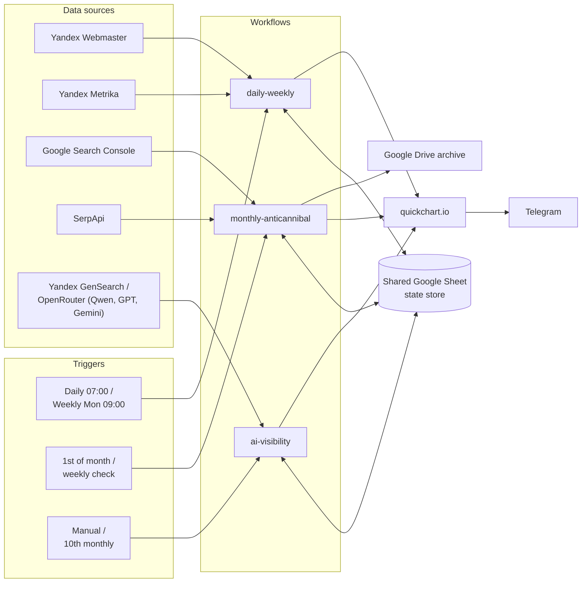

# SEO monitor suite (n8n)

Three interconnected n8n workflows for monitoring a Russian-market e-commerce
site's SEO health: uptime/content auditing, monthly reporting with keyword
cannibalization detection, and brand visibility tracking across AI answer
engines (GEO/AIO).

## Workflows

| Folder | Purpose | Trigger |
|---|---|---|
| [`daily-weekly/`](./daily-weekly) | Uptime + content-drift monitoring | Daily 07:00 / Weekly Mon 09:00 |
| [`monthly-anticannibal/`](./monthly-anticannibal) | Monthly SEO report + keyword cannibalization engine | 1st of month / weekly Mon 09:00 |
| [`ai-visibility/`](./ai-visibility) | Brand visibility across Yandex GenSearch, GPT, Gemini, Qwen | Manual / monthly 10th |

## Sample output

A taste of what each workflow actually sends — full formats, all message
variants, and the sheet schemas are in each workflow's own README.

**daily-weekly** — a Telegram message plus an attached log:
```
📊 SEO Monitor (Daily scan):

Pages checked: 24
✅ All pages OK. No errors.
```
→ [full daily/weekly formats](./daily-weekly/README.md)

**monthly-anticannibal** — a monthly traffic summary, plus a separate
cannibalization scan:
```
📊 SEO Category Summary (30 days)

Yandex visits: 340
   └ Previous 30 days: 310 (Δ +30) 🔼
```
→ [full monthly + cannibalization formats](./monthly-anticannibal/README.md)

**ai-visibility** — whether an AI engine's answer mentions the brand or
cites the site:
```
🤖 AI Visibility · 2026-09-05
GPT: Brand 6/12 (50%) · Site mention 7/12 (58%)
```
→ [full AI visibility format + cost breakdown](./ai-visibility/README.md)

## Architecture

All three workflows read/write a single Google Sheet used as a shared state
store, keyed per-run so reruns don't repeat paid API calls:

`Daily_Log`, `Weekly_Log`, `Monthly_Log`, `Daily_Monitor`, `Baseline_Metrics`,
`Master_Briefs`, `Owner_Map`, `Cannibalization_State`, `Cannibalization_History`,
`Query_Discovery`, `SEO_Page_Snapshot`, `SEO_Run_State`, `SEO_Change_Log`,
`SERP_Query_State`, `SERP_Query_History`, `AI_Visibility_State`, `AI_Visibility_History`

Data sources: Yandex Webmaster, Yandex Metrika, Google Search Console,
SerpApi (live SERP checks), Yandex GenSearch / OpenRouter (Qwen, GPT,
Gemini). Charts render via quickchart.io. Reports deliver to Telegram,
archive to Google Drive.



## Stack

- n8n (self-hosted / cloud)
- Google Sheets as state store
- Telegram for report delivery
- Yandex Webmaster API, Yandex Metrika, Google Search Console
- SerpApi (SERP tracking), OpenRouter (Qwen/GPT/Gemini), Yandex GenSearch

## Setup

1. Import the workflow JSON from the relevant folder into n8n.
2. Fill in n8n credentials for: Google Sheets, Google Drive, Telegram, OpenAI/OpenRouter.
3. Open each `Config` / `Config — ...` code node and replace the placeholder
   values (`YOUR_GOOGLE_SHEET_ID`, `YOUR_SERPAPI_KEY`, etc. — see `.env.example`).
4. Import [`SEO_Monitor_template.xlsx`](./SEO_Monitor_template.xlsx) into
   Google Sheets to get all the required tabs with the right headers — see
   each workflow's README for what each tab means.

## Related writeups

- TODO: link master Habr article
- TODO: link per-workflow Habr articles

## License

MIT — see [LICENSE](./LICENSE).
