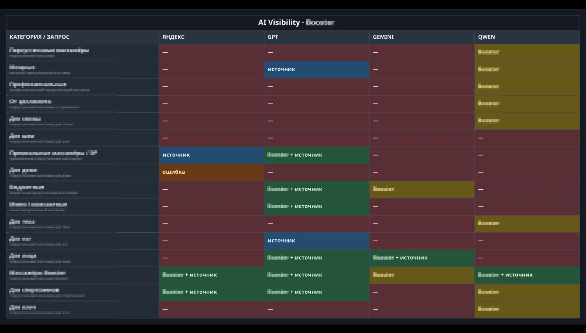
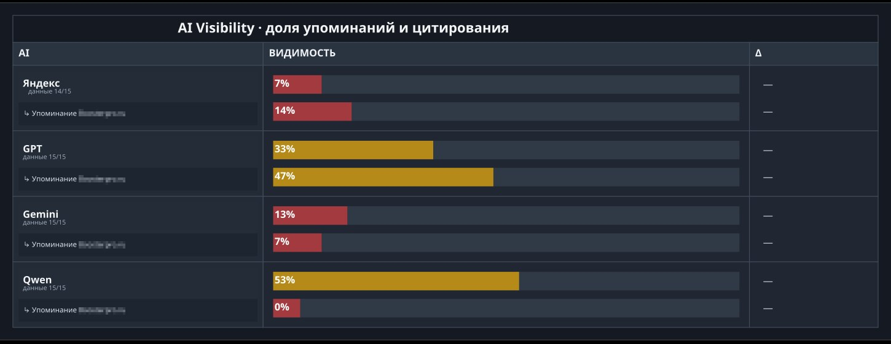
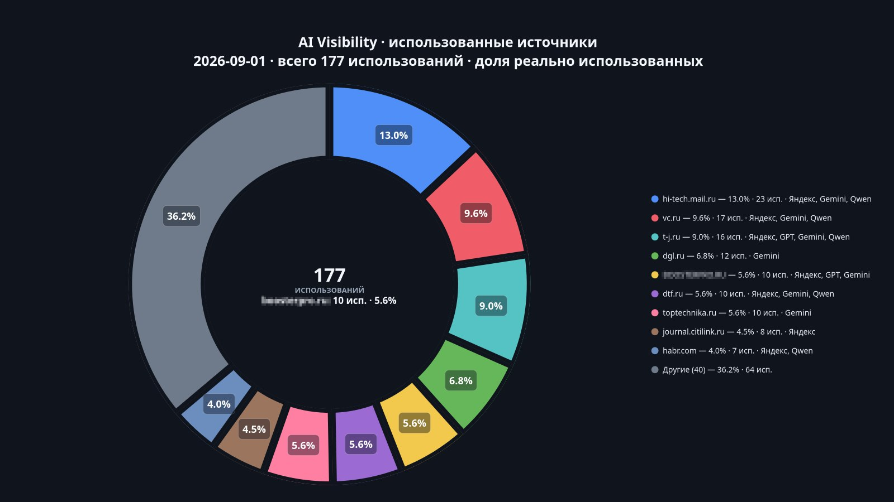

# ai-visibility

Tracks whether a brand and its site get surfaced by AI answer engines for
each category's main commercial query: Yandex GenSearch, and GPT / Gemini /
Qwen via OpenRouter.

## Triggers

- Manual (button in n8n)
- Schedule — 10th of the month, 10:00

## What it does

For every category in `Master_Briefs` flagged `ai_monitor` (or all valid rows
if none are flagged — hard safety cap: 20 categories, the workflow refuses to
run and spend money past that), asks all 4 engines the category's
`primary_query` and checks whether the answer mentions the brand and/or
cites the site as a source. Prompts are deliberately terse: the non-Yandex
engines get a system prompt that requires exactly one web search, then up
to 5 brand/model names, one per line, no explanation. That's what keeps
this cheap — see **Cost** below — but it also means the report tracks
*recommendation frequency*, not review quality or sentiment.

Sends 5 messages per run: the text summary, 3 chart photos (visibility
matrix, visibility-share bars, source-domains donut), and the full HTML
report as a document. The HTML is also archived to Google Drive.

## Cost per run

- **OpenRouter (GPT + Gemini + Qwen combined)**: roughly **$0.30–0.40** for
  a run across ~15 categories — this isn't a guess; the workflow reads the
  real figure straight from OpenRouter's own per-call accounting
  (`usage.cost` on each response) and sums it, so every archived run has
  its own exact cost.
- **Yandex GenSearch**: Yandex's Search API bills a flat rate per
  synchronous request with a generative answer, independent of answer
  length: **5.08 ₽/request** (5,080 ₽ per 1,000 requests, per Yandex's
  published pricing). For ~15 categories that's roughly **75–80 ₽**. The
  rate is hardcoded in the workflow's config node and matches the official
  price.
- All-in, that's well under $1 for a full run across every engine.

Both figures are printed in the HTML report's header and in the KPI pills,
so every run's actual cost is right there in the archive.

**If you want fuller, written answers instead of a bare model list:** it
gets more expensive on the OpenRouter side only. GPT/Gemini/Qwen are billed
by token, so a longer prompt and a longer allowed response (this workflow
caps output at 120–160 tokens) directly raises `usage.cost` per call.
Yandex's price doesn't move — it's a flat per-request fee regardless of how
long the generated answer is — so only the OpenRouter total would grow.

## Charts

**🤖 "AI Visibility · [Brand]"** — matrix table, one row per category, one
column per engine (Яндекс / GPT / Gemini / Qwen). Cell meaning by color:
dark red "—" (neither mentioned), gold "Brand" (brand named, site not
cited), blue "источник" (site cited, brand not named), green "Brand +
источник" (both), brown "ошибка" (the call failed), grey "отключено" (engine
disabled for this run).



**📊 "AI Visibility · доля упоминаний и цитирования"** — one row per engine,
two bars each: share of queries where the brand is mentioned, and share
where the site is cited, plus a Δ column once a previous snapshot exists.

  

**🌐 "AI Visibility · использованные источники"** — donut of every source
domain used across all engines/categories, top domains by share plus an
"Others" wedge, the site's own slice called out; center shows total uses
and the site's own count/share.



## Text summary (HTML parse mode)

Example with placeholder data (a 12-category run):

```
🤖 AI Visibility · 2026-09-05
Yandex: Brand 3/12 (25%) · Site mention 4/12 (33%) · errors 0
GPT: Brand 6/12 (50%) · Site mention 7/12 (58%)
Gemini: Brand 2/12 (17%) · Site mention 3/12 (25%)
Qwen: Brand 4/12 (33%) · Site mention 2/12 (17%)

📈 Change vs the last saved snapshot
— no comparable previous snapshot yet

🌐 Sources used · 140 uses
1. example-media-1.ru — 12.0% · 17 · Yandex, Gemini, Qwen
2. example-review-hub.ru — 9.0% · 13 · Yandex, Gemini
3. example-marketplace.ru — 8.0% · 11 · Yandex, GPT, Gemini, Qwen
4. example-tech-blog.ru — 7.0% · 10 · Gemini
5. example-shop.com — 6.0% · 8 · Yandex, GPT, Gemini
6. example-forum.ru — 5.0% · 7 · Yandex, Qwen
7. example-catalog.ru — 5.0% · 7 · Gemini
8. example-journal.ru — 4.0% · 6 · Yandex
… 35 more sources — in the full report
```

The denominator (`/12`) is *successful* calls, not attempts — an engine's
own errors are reported separately and don't get held against its rate. If
an engine is disabled it prints "disabled" instead of numbers; if too few
calls succeeded to publish a rate it prints "not enough data · X/Y ·
errors Z". Up to 10 sources are inlined and the site's own domain is
always pinned into that list even if its raw rank would fall outside the
top 10. "Change vs the last saved snapshot" only shows engines that have
prior saved state to compare against.

## Attached file: HTML report

Unlike the other two workflows, the full report is an **HTML file**, not
markdown — a full run is 4 engines × ~15 categories of raw answers plus
source lists, so everything not in the header tables is collapsed by
default via `<details>`.

Structure:

- **Header** — brand, date, run mode, category count, and the two live cost
  figures (`OpenRouter: $0.XX`, `Yandex: ~XX ₽`)
- **Сводка** (Summary) table — same per-engine numbers as the Telegram
  summary
- **Использованные источники** (Sources used) table — every domain, not
  just the top 10 shown in Telegram
- **Ответы по запросам** (Answers per query) — one collapsed block per
  category, each with the target URL/H1/Title/Description for context, then
  one sub-section per engine: brand/site mention (yes/no), any brand model
  names found, that call's OpenRouter cost (not shown for Yandex, which
  bills flat per request rather than per response), a nested collapsed
  block with the raw answer text, and the list of sources that engine
  actually returned, each marked ✅ used/cited or ○ found-but-unused

Example (sanitized, one category, one engine):

```html
<details>
  <summary>Example Category · <span class="muted">example category query</span></summary>
  <div class="inside">
    <div class="small muted">Target: https://example-shop.com/collection/example-category</div>
    <div class="small">H1: Example Category</div>
    <div class="small">Title: Example Category Title</div>
    <div class="small">Description: Example meta description.</div>

    <h3>GPT</h3>
    <p>Brand: <strong class="yes">YES</strong> · Site mention: <strong class="yes">YES</strong></p>
    <p>Models found: Example Model X</p>
    <p class="small muted">Cost: $0.0073</p>
    <details><summary>Raw answer</summary><pre>Example Model X
Competitor Model Y
Competitor Model Z</pre></details>
    <h4>Sources used</h4>
    <ul>
      <li>✅ cited · <a href="https://example-shop.com/">Example Shop — homepage</a></li>
      <li>✅ cited · <a href="https://example-review-site.com/">Example review roundup</a></li>
    </ul>
  </div>
</details>
```

## Prompting

- **Yandex GenSearch**: one request per category with the raw
  `primary_query`, `enableRichStructuredAnswer: true`.
- **GPT / Gemini / Qwen (OpenRouter)**: a system prompt requires exactly one
  web search (`tool_choice: required`, `temperature: 0`), then up to 5
  brand/model names, one per line, no explanation. Output capped at
  120–160 tokens — this, not the search itself, is what keeps the per-call
  price down.

## Sheets used

| Tab | Role |
|---|---|
| `Master_Briefs` | Config — shared with the other workflows; supplies each category's `primary_query` and the `ai_monitor` flag that decides which categories get checked |
| `Daily_Monitor` | Config — shared; supplies the H1/Title/Description shown for context in the report |
| `AI_Visibility_State` | Output — one row per (mode, provider, category), upserted each run; this is the "last saved snapshot" the Δ figures compare against |
| `AI_Visibility_History` | Output — append-only, one row per (mode, run, provider, category) |

**`AI_Visibility_State` / `AI_Visibility_History` columns:** `state_key` /
`history_key`, `checked_at`, `run_id`, `provider`, `provider_label`, `model`,
`slug`, `category`, `query`, `owner_url`, `score_eligible`,
`brand_control`, `brand_mentioned`, `site_cited`, `models_mentioned`,
`source_urls`, `answer_text`, `data_error`, `error`, `state_hash`

`answer_text` is always saved blank on purpose — the full raw answer only
lives in the HTML archive, not in the spreadsheet. Per-call OpenRouter cost
and the Yandex ruble estimate are shown in the report but aren't written to
either sheet; they only exist at the run level.
