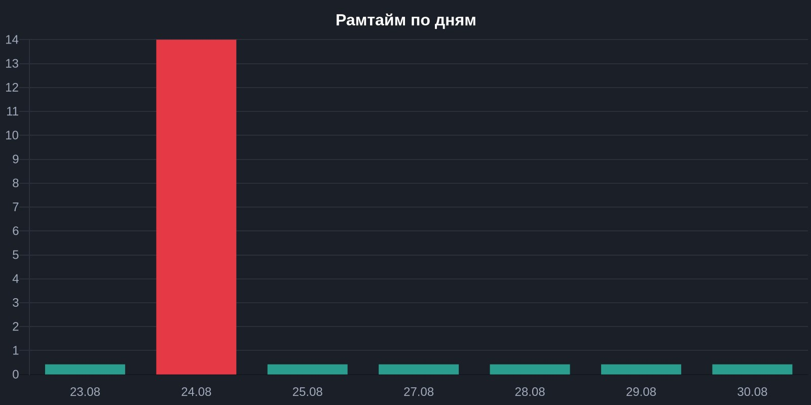

# daily-weekly

Uptime and content-drift monitoring for the store's category pages: checks HTTP
status, redirects, `noindex`, and H1/Title/Description drift against a config
sheet, then reports to Telegram and logs the result.

## Triggers

| Report | Schedule | On-demand |
|---|---|---|
| Daily | Every day at 07:00 | Any message to the Telegram bot |
| Weekly | Monday at 09:00 | Any message to the Telegram bot |

Pages are fetched through a Yandex Cloud Function proxy (`FUNCTION_ID` in
`.env.example`) rather than directly, to get a clean HTML snapshot per page.

## Daily report

Checks every active row in `Daily_Monitor` — target pages and redirects —
against its expected values:

- HTTP status matches `expected_status`
- Redirects (`type: redirect`) land on `expected_target`
- Target pages aren't `noindex`
- H1 / Title / Description contain the expected snippet (case-insensitive)

Each line gets an icon: ✅ pass, ⚠️ soft mismatch (tag present but doesn't
match), ❌ hard failure (wrong status, network error, missing tag, `noindex`,
wrong redirect target).

**Telegram message** (HTML parse mode):

```
📊 SEO Monitor (Daily scan):

Pages checked: 27
✅ All pages OK. No errors.
Full log attached below.
```

or, when something fails:

```
📊 SEO Monitor (Daily scan):

Pages checked: 27
⚠️ Issues found: 2
Detailed log attached below.
```

**Attached file** (`Daily_SEO_Report_<date>.md`) — example with placeholder
data:

```markdown
# Daily SEO Report (example-shop.com)
**Initiator:** Daily scan
**Date:** 2026-09-05

## Page details

- ✅ **200** | /collection/example-category
- ✅ **301** | /collection/old-slug-redirect
- ⚠️ **200** | /collection/mismatched-title [Title mismatch]
- ❌ **ERR** | /collection/timeout-page [Failed: Timeout: Failed to perform, cu]

**Total errors/warnings:** 2
```

Other flags that can show up in the same slot: `[Status: X, expected: Y]`,
`[noindex!]`, `[H1 missing]`, `[Description missing]`, `[Bad redirect to: ...]`.

`Initiator` is either `Daily scan` (schedule) or `Triggered in Telegram
(@username)` (on-demand run).

## Weekly report

Runs the same active pages through a deeper content check plus a Yandex
Webmaster snapshot, and rolls the last 7 daily runs into an uptime %.

Per category page, checks:

- Product count vs `expected_products`
- Named products from `expected_names` are present in the page
- Required JSON-LD schema is present (`BreadcrumbList` always; `ItemList` /
  `FAQPage` / `Article` / `Product` depending on page type), and any
  out-of-stock items are pulled from that schema
- Images inside the SEO text block have `alt` text

**Telegram message** (HTML parse mode, sent as the caption on the runtime
chart photo):

```
📈 WEEKLY SEO REPORT (2026-09-05)

• Uptime: 86%
• Yandex index: 223 pages | ИКС (site quality index): 140

⚠️ Issues found (1 category):
⚠️ /collection/example-category

Full log attached below.
```

Up to 10 issue lines are inlined directly in the message; beyond that it adds
`... and N more`.

**Runtime chart** — a quickchart.io bar chart of the last 7 days: error count
per day, green bars for clean days and red for days with failures. Sent to
Telegram as a photo with the summary above as its caption.



**Attached file** (`Weekly_SEO_Report_<date>.md`) — four sections: Yandex
Webmaster snapshot, 7-day uptime, deviations (one block per page with issues),
and the full list of clean pages. Example with placeholder data:

```markdown
# Weekly SEO Report (example-shop.com)
**Report date:** 2026-09-05

## 1. Yandex Webmaster summary
- **Pages in Yandex search:** 223
- **Site quality index (ИКС):** 140
- **Issue status:** OK

## 2. 7-day stability
- **Uptime:** 86%
- **Failures this week:** 14

## 3. Deviations found

### ⚠️ /collection/example-category (Products: 5)
- ⚠️ **Stock:** Out of stock: Example Product Name

## 4. Successfully checked pages (15)

<details>
<summary>Show all 15</summary>

- ✅ **/collection/example-category-1** (Products: 11 | Schema: OK)
- ✅ **/collection/example-category-2** (Products: 8 | Schema: OK)
- ✅ **/collection/example-category-3** (Products: 5 | Schema: OK)
- … 12 more

</details>
```

Other flags that can show up under a deviation: `**Assortment:** Found N
(should be exactly M)`, `**Missing key products:** ...`, `**Schema:** JSON-LD
block not found` / `missing: ...`, `**Images:** missing ALT (N)`.

## Sheets used

| Tab | Role |
|---|---|
| `Daily_Monitor` | Config — one row per URL, read-only input |
| `Daily_Log` | Output — one row appended per daily run |
| `Weekly_Log` | Output — one row appended per weekly run |

**`Daily_Monitor` columns:** `url`, `type` (`target` / `redirect`),
`expected_status`, `expected_target`, `expected_h1`, `expected_title`,
`expected_desc`, `active`, `group`, `expected_products`, `expected_names`

**`Daily_Log` columns:** `date`, `status` (`OK` / `ERROR`), `total_checked`,
`errors_count`, `Initiator`, `error_details` (one `icon url [reason]` line per
issue, `—` if none)

**`Weekly_Log` columns:** `week_date`, `status` (`OK` / `WARNING`),
`daily_uptime`, `webmaster_pages_in_search`, `webmaster_errors`,
`content_warnings`, `weekly_summary`
