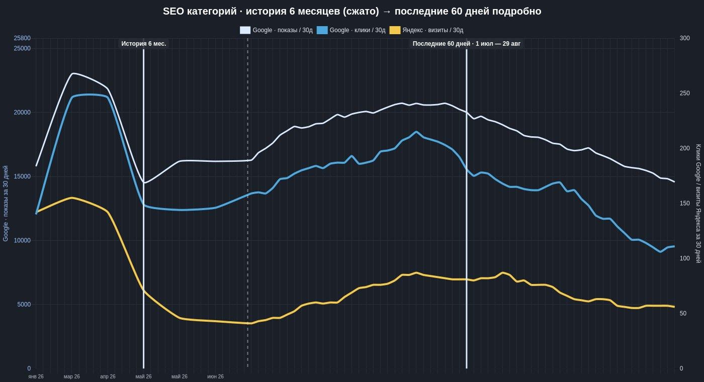
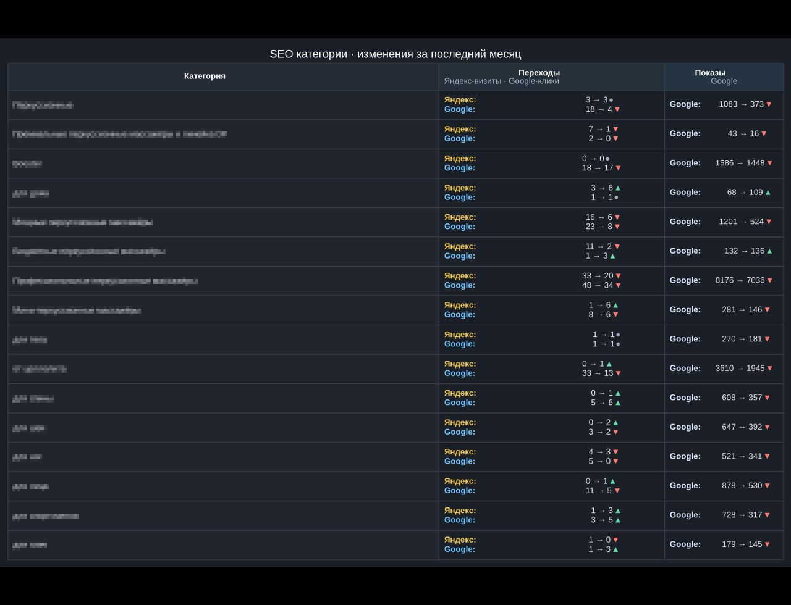
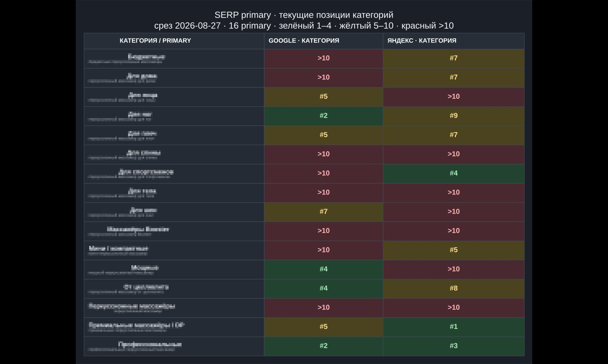
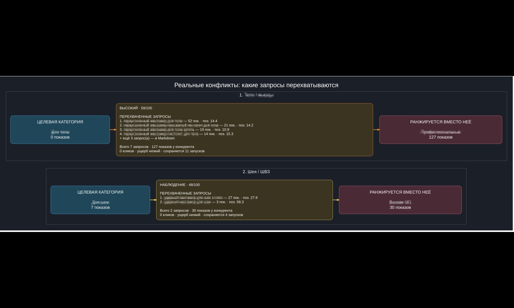
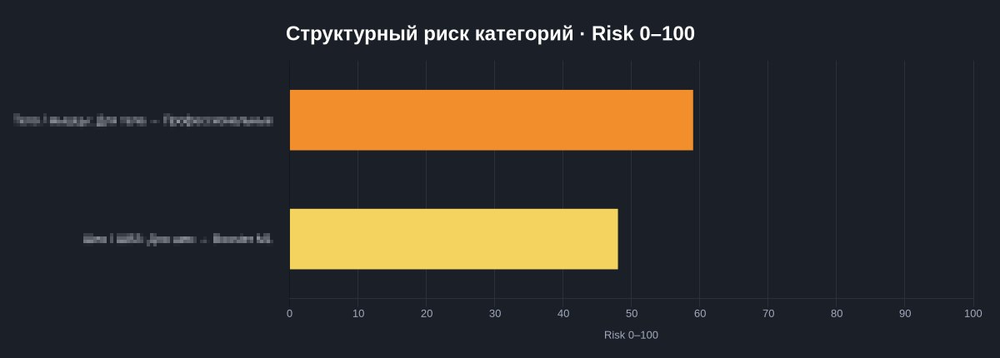

# monthly-anticannibal

Combines two independent runs in one workflow: a monthly SEO health report for
category pages, and a weekly keyword-cannibalization scan that shares its data
model with the report.

## Triggers

| Report | Schedule |
|---|---|
| Monthly report | 1st of the month |
| Cannibalization scan | Monday 09:00 |

## Monthly report

### What it does

Pulls Google Search Console, Yandex Metrika, and Yandex Webmaster for every
active category in `Daily_Monitor`, compares the last 30 days against the
previous 30 and against the same period last year, and models the site-wide
traffic shift so a category's numbers are judged against what the *whole
site* did, not an absolute threshold. It checks SERP position for each
category's `primary_query`, and folds in the latest cannibalization
snapshot. An LLM (Qwen via OpenRouter) turns the numeric result into a
4-part written read; a separate, deterministic pass turns the same numbers
into a per-category markdown file with severity buckets.

A run sends 6 messages, in this order: 3 chart photos, the text summary, the
markdown file, the AI-written analysis.

### 1–3. Charts

**📈 "SEO categories · 6-month history (compressed) → last 60 days
detailed"** — dual-axis line chart, 3 series: Google impressions/30d
(white), Google clicks/30d (blue), Yandex visits/30d (yellow). The left
portion compresses 6 months into monthly points; a vertical marker splits
off the last 60 days, shown day by day.



**📊 "SEO categories · changes over the last month"** — one table row per
category: Yandex visits and Google clicks (current → previous, with a
▲/▼/● marker) and Google impressions (current → previous).



**🔎 "SERP primary · positions"** (title becomes "... positions and
movement" once ~30 days of history exist) — one row per category's
`primary_query`: Google and Yandex position, color-coded green 1–4 / yellow
5–10 / red >10. Once there's a prior snapshot to compare, each cell also
gets a small move arrow.



### 4. Summary message (Msg 1, HTML)

```
📊 SEO Category Summary (30 days)

TRAFFIC & SALES

Yandex visits: 56
   └ Previous 30 days: 81 (Δ -25) 🔻

Google clicks: 108
   └ Previous 30 days: 181 (Δ -73) 🔻

Google impressions: 13,996
   └ Previous 30 days: 20,011 (Δ -6,015) 🔻

🛒 Orders: 0

💳 Revenue: 0 ₽

AFTER RE-OPTIMIZATION

Yandex: 79 → 56 🔻 -29.1% · expected ~83 · worse than site trend
Google clicks: 185 → 109 🔻 -41.1% · expected ~148 · worse than site trend
Google impressions: 19,906 → 14,398 🔻 -27.7% · expected ~14,041 · roughly in line with site

BEHAVIOR (average)

Bounce rate: 42.9%
   └ Previous 30 days: 40.7% (Δ +2.1 pp) 🔻

Time on site: 2m 11s
   └ Previous 30 days: 2m 2s (Δ +9s) 🔼

Page depth: 1.68
   └ Previous 30 days: 1.81 (Δ -0.14) 🔻

📄 Detailed per-category stats are in the attached file.

🛡️ Category cannibalization: 1 internal conflict · low impact
🔀 Other site pages: 1 overlap · low impact

🔎 SERP primary: 16 queries · target category positions
Google: 🟢 1–4 4 · 🟡 5–10 4 · 🔴 >10 8
Yandex: 🟢 1–4 3 · 🟡 5–10 6 · 🔴 >10 7
📍 Monthly movement is still accumulating history; showing current target-category positions for now.
```

"AFTER RE-OPTIMIZATION" only shows once there's a fair before/after window;
otherwise it prints "Not enough data yet for an equal before/after
comparison." The cannibalization and SERP-band lines are appended in a
later step and only appear when there's something to report.

### 5. Attached file (`SEO_Categories_Monthly_<date>.md`, Msg 2)

Structure: an intro (re-optimization effect, 30-day summary, YoY context,
SERP position table, any changes under formal observation), then every
category bucketed by severity.

```markdown
# SEO category analysis · monthly · 30 days

> Categories only.

## 🧪 After re-optimization

- Yandex visits: **79 → 56** (-29.1%); expected from site movement ~83; **worse than site trend**.
- Google clicks: **185 → 109** (-41.1%); expected ~148; **worse than site trend**.
- Google impressions: **19,906 → 14,398** (-27.7%); expected ~14,041; **roughly in line with site**.

## 📊 Last 30 days summary

- Yandex visits: **81 → 56** (-30.9%)
- Google clicks: **181 → 108** (-40.3%)
- Google impressions: **20,011 → 13,996** (-30.1%)
- Yandex, site-wide: **2,533 → 2,691** (+6.2%)
- Google clicks, site-wide: **1,871 → 1,457**
- Google impressions, site-wide: **88,831 → 60,970**

## 📅 Year-over-year · extra context

- Yandex: 4 of 16 categories · 54 → 32 (-40.7%)
- Google clicks: 6 of 16 · 69 → 71 (+2.9%)
- Google impressions: 9 of 16 · 7,506 → 12,709 (+69.3%)

## 🔎 SERP primary — positions and movement

> Shows the position of the assigned (owner) URL. Monthly arrows appear once 21–45 days of history have accumulated.

- Primary queries: **16**
- Snapshot date: **2026-08-27**
- Google: TOP 1–4 **4** · 5–10 **4** · >10 **8**
- Yandex: TOP 1–4 **3** · 5–10 **6** · >10 **7**

| Category | Primary query | Google | Δ | Yandex | Δ |
|---|---|---:|---:|---:|---:|
| Example category A | `example query a` | >10 | — | #7 | — |
| Example category B | `example query b` | #5 | — | #1 | — |

## 🛠 Changes under observation

*No active WATCH changes.*

---

<details>
<summary>Per-category breakdown, bucketed by severity (long — click to expand)</summary>

## 🟢 Normal — 0

*None*

---

## 🟡 Needs watching — 10

### 🔹 Example Category A

**Yandex visits:** **0**
├ Previous 30 days: 0 (Δ 0) ➖
└ Last year: 5 (Δ -5) 🔻

**Google impressions:** **1,448**
├ Previous 30 days: 1,586 (Δ -138) 🔻
└ Last year: 3,730 (Δ -2,282) 🔻

**Google clicks:** **17**
├ Previous 30 days: 18 (Δ -1) 🔻
└ Last year: 15 (Δ +2) 🔼

**Behavior**
Bounce rate: **0%**
└ Previous 30 days: 0% (Δ 0.0 pp) ➖

Time on site: **0s**
└ Previous 30 days: 0s (Δ 0s) ➖

Page depth: **0**
└ Previous 30 days: 0 (Δ 0.00) ➖

⚪ Behavior: fewer than 10 Yandex visits — not treated as a reliable signal.

*💡 Takeaway:* Holding up better than the overall site trend. This month: Yandex flat, Google clicks down, Google impressions down.

---

… 9 more categories in this bucket, same card format …

## 🔴 Needs attention — 0

*None*

## 🟣 Data check — 0

*None — reserved status; the current classifier never actually emits it.*

## ⚪ Low data — 6

… same card format as "Needs watching" above, for categories with too little Yandex/short-term signal to classify …

## ⚙️ Data quality

- Yandex Metrika: OK / OK / OK (current / previous / year-over-year)
- GSC: OK / OK / OK
- Snapshot: `PAGE-V3:2026-08-30:M:2026-08-30`
- Cannibalization snapshot: `CANNIB:2026-08-30:YQ:2026-08-30`

</details>
```

Severity buckets, in report order: 🟢 Normal, 🟡 Needs watching (the
default when signals disagree), 🔴 Needs attention (also gets an inline
"🔍 diagnose" button on the Telegram summary), 🟣 Data check (defined in the
report structure but not currently produced by the classifier), ⚪ Low data
(under 10 Yandex visits and no usable short-term signal).

### 6. AI analysis message (Msg 3, HTML)

A second LLM pass over the same numbers, always in this 4-part shape:

```
📊 Monthly category SEO analysis (30–34 days after changes)

1. 📈 Chart 1 — history and last 60 days
[2–4 sentences on the long-run trend and the last-60-day detail]

2. 📊 Chart 2 — last month
[2–4 sentences on which categories are driving the change]

3. 🔎 SERP primary — positions
[2–4 sentences on current/moving positions; explicitly says there's no monthly delta yet until baseline history exists]

4. 🧭 Outlook
🟡 WATCH
[1–2 sentences]
```

The first line under "Outlook" is constrained by the prompt to always be
exactly one of 🟢 CALM, 🟡 WATCH, or 🔴 ACTION NEEDED. If the model's output
doesn't parse into those 4 sections, each one falls back to a plain sentence
built directly from the numbers, so this message never comes back empty.

## Cannibalization scan

### What it does

Runs weekly, separately from the monthly report but sharing most of its data
model. Scores two kinds of conflict for every category:

- **Internal category conflict** — another category page outranks the owner
  for the owner's own query cluster
- **Sitewide cross-type overlap** — a product page, article, or other URL on
  the site outranks the category

A `risk_score` (0–100) combines: how much of the shared-query traffic the
competitor dominates, average SERP position, competitor clicks, week-over-week
trend, a structural-mismatch flag (e.g. the owner has 0 impressions while the
competitor has 10+), and how many consecutive runs the conflict has
persisted. A confidence multiplier (0.25–1.0) scales the score down when
query volume is thin. Separately, and without affecting that score, every
category's `primary_query` (from `Master_Briefs`) is checked against
cached/live SERP as a non-scoring control layer — pure evidence, not an
input to severity.

Sends 4 messages per run: 2 chart photos, the text summary (with a Google
Drive link to the full report), and the markdown file.

### Severity model

| Severity | Condition |
|---|---|
| `LOW_DATA` | combined impressions < 10 and clicks < 2 |
| `WATCH` | risk_score ≥ 30 |
| `HIGH` | risk_score ≥ 55 |
| `CRITICAL` | risk_score ≥ 75, competitor holds ≥65% of shared impressions, and either 2+ consecutive runs or 200+ impressions |

A single traffic spike can't trigger `CRITICAL` on its own — it needs either
repeat occurrences or real volume behind it.

### 1–2. Charts

**🧩 "Real conflicts: which queries get hijacked"** — a flowchart, one block
per scored conflict (WATCH/HIGH/CRITICAL only): target category → its top
intercepted queries (with impressions/position) → the page that actually
ranks instead.



**🔎 "Structural risk by category · Risk 0–100"** — horizontal bar chart,
one bar per scored conflict, `risk_score` on the x-axis.



### 3. Summary message (HTML)

```
🛡️ SEO Category Cannibalization

What we found
There are currently 2 significant conflicts by the main score. Critical — 0, high — 1, watch — 1.

🟠 Top conflict: Body / muscles — 59/100 (high)
The target category "For body" barely captures this cluster: 0 impressions. "Professional" ranks instead more often: 127 impressions over 28 days.
This has persisted for 11 runs now. The competing page gets 0 clicks on these queries, so actual damage is currently low.
The conflict is easing: the competing page's impressions dropped 217 → 127 over 28 days and 37 → 14 over the last 7.
BoosterPro currently isn't visible in the TOP10 on Google or Yandex for the primary query. That doesn't cancel the 28-day conflict — the current SERP is just below the top 10.

🟡 Neck / collar zone — 48/100
"For neck" competes with a product page: 7 impressions on the target page vs 30 on the other. This has held for 4 runs. No clicks on the competing page yet, so impact is low.
Trend is worsening: the competing page's impressions grew 12 → 30 over 28 days and 7 → 14 over the last 7.

🔎 Primary-query control
16 category primary queries are tracked:
✅ correct page confirmed — 6
⚠️ a different page ranks — 1
🟡 mixed result — 6
⚪ BoosterPro outside TOP10 — 2
🔵 branded / ambiguous query — 1
Cache was fresh enough — SerpApi wasn't called this run.
Specific queries, URLs, and Google/Yandex positions are in the full markdown report.

What to do now
Start with the "For body" ↔ "Professional" pair: Title/H1, copy, internal links, and intent boundaries. Watch the rest (Neck / collar zone) and don't rewrite pages without a rise in clicks/impressions. SERP control on its own isn't a command to edit — the detailed evidence is left in the markdown.

🔗 Full report: [Open in Google Drive]
```

The message is capped at ~3,900 characters (truncated with `…` past that).
Only the single highest-scoring conflict gets the full write-up; up to 2
more scored conflicts each get a one-line mention.

### 4. Attached file (`SEO_Cannibalization_v<version>_<date>.md`)

Ten sections:

1. **Data Quality** — raw counts from every data source that fed the run
   (GSC 28d/7d current+previous, Yandex query analytics, Yandex Metrika,
   `Owner_Map` / `Query_Discovery` / `SERP_Query_State` row counts, SerpApi
   live-call stats)
2. **Summary** — counts by severity, split internal vs sitewide, plus a
   combined LOW_DATA / RESOLVED / NEW / WORSENING tally
3. **Categories — internal status and external capture** — one line per
   category: its internal status and its sitewide status
4. **Primary query + SERP control** — one card per category: `primary_query`,
   expected owner, GSC 28d for the top-ranking page vs the owner page,
   live/cached Google + Yandex SERP position, and an `Evidence` verdict
   (`OWNER_CONFIRMED`, `MIXED`, `CONFIRMS_CONFLICT`, `NOT_FOUND_TOP10`,
   `INTENT_AMBIGUOUS`)
5. **Internal category competition** — full incident cards for scored
   internal conflicts (example below)
6. **Category capture by other site pages** — same card shape, for sitewide
   cross-type conflicts
7. **Resolved incidents** — anything that dropped out of scoring since the
   last run
8. **LOW_DATA — don't alarm on these** — conflicts below the scoring floor,
   listed for visibility only
9. **Query Discovery queue** — new queries seen in GSC that aren't in
   `Owner_Map` yet, each with a suggested cluster/owner and a confidence
   label (`MASTER_PRIMARY`, `RULE_MARKER`, `UNCLASSIFIED`, `MODEL_QUERY`)
10. **AI summary** — an LLM narrative: what changed, internal conflicts,
    sitewide conflicts, what to check next

Example incident card (section 5/6), with placeholder data:

```markdown
### 🟠 Example Cluster — HIGH 59/100

- **Scope:** INTERNAL_CATEGORY
- **Incident key:** `example_cluster|/collection/example-a|/collection/example-b`
- **Confidence:** HIGH (0.9)
- **Lifecycle:** PERSISTING | **Trend:** STABLE | **Consecutive runs:** 11
- **Type:** OWNER_MISSING / SIBLING_CATEGORY
- **Owner:** `/collection/example-a`
- **Competitor:** `/collection/example-b` (category)
- **Queries in conflict:** 7
- **Impressions 28d:** owner 0 / competitor 127 (100.0% competitor share)
- **Clicks 28d:** owner 0 / competitor 0
- **Traffic impact:** LOW
- **Avg. position:** owner — / competitor 15.5
- **Previous 28d, impressions:** owner 0 / competitor 217
- **7d:** owner 0 / competitor 14; previous 7d 0/37
- **Yandex:** MIXED/LOW_DATA; competitor impressions 0; pos —
- **Page-level owner:** status LOW_DATA; Google 180 imp / 1 click (87.8% of baseline); Yandex 1 visit (5.9% of baseline)
- **SERP evidence:** NOT_FOUND_TOP10 — google: NOT_FOUND; yandex: NOT_FOUND
- **Primary query:** yes (exact match with Master_Briefs.primary_query)

**Query-level evidence:**

- `example query 1`: owner 0 imp / pos —; competitor 52 imp / pos 14.4
- `example query 2`: owner 0 imp / pos —; competitor 21 imp / pos 14.2

**Diagnosis:** The sibling category ranks for the cluster while the assigned owner is essentially absent. Page-level context for the owner: 180 Google impressions / 1 click over 30d, 1 Yandex visit. The gap is specific to this query cluster, not the whole page.

**To check:** Compare Title/H1/H2, the intent boundaries from `Master_Briefs`, and internal anchors on both categories. Only change copy after confirming the specific overlap.

**Owner intent boundaries (from Master_Briefs):** category-specific rules — what the owner page must not claim, and where it should hand off via a link.

**Owner_Map rule:** candidate pages must not use this query in Title/H1; a link or brief mention is fine.
```

## Sheets used — monthly report

| Tab | Role |
|---|---|
| `Daily_Monitor` | Config — shared with `daily-weekly`; category URLs come from here |
| `Baseline_Metrics` | Config — one row per URL, pre-optimization baseline used to model "expected if site" |
| `SEO_Change_Log` | Config/log — individually tracked on-page changes; drives "Changes under observation" |
| `Monthly_Log` | Output — one row appended per monthly run |

**`Baseline_Metrics` columns:** `url`, `optimization_date`,
`google_clicks_base`, `google_impressions_base`, `google_avg_position`,
`search_visits_base`, `orders_base`, `revenue_base`, `bounce_rate_base`,
`time_on_site_base_sec`, `page_depth_base`

**`SEO_Change_Log` columns:** `change_id`, `page_type`, `url`,
`change_date`, `change_type`, `reason`, `source_report`, `what_changed`,
`hypothesis`, `tracking_status`, `manual_comment`

**`Monthly_Log` columns** (one row per run, grouped by theme):

- Identity: `report_date`, `snapshot_id`, `status`, `updated_at`
- Data-source coverage: `gsc_data_end`, `metrika_data_end`
- Category traffic, current/prev/YoY 30d + deltas: `category_organic_*`,
  `category_gsc_clicks_*`, `category_gsc_impressions_*`
- Site-wide traffic, same shape: `site_organic_*`, `site_gsc_clicks_*`,
  `site_gsc_impressions_*`
- Category's share of the site: `category_share_current_pct`,
  `category_share_prev_pct`, `category_share_yoy_pct`,
  `category_share_yoy_delta_pp`
- Expected-vs-actual model: `expected_category_organic_from_site_yoy`,
  `organic_structural_residual_pct`, `gsc_click_structural_residual_pct`,
  `gsc_impression_structural_residual_pct`
- Status flags: `structural_status`, `short_term_status`, `yoy_status`,
  `context_status`, `analysis_confidence`
- Cannibalization linkage: `cannibalization_active_count`,
  `cannibalization_snapshot_id`
- Narrative (LLM output): `current_situation`, `dynamics`, `recommendations`
- Link: `report_link` (Google Drive)

## Sheets used — cannibalization scan

| Tab | Role |
|---|---|
| `Owner_Map` | Config — which URL owns which query, forbidden pages, human-readable rule text |
| `Master_Briefs` | Config — shared with content work; supplies each category's `primary_query` and the intent-boundary text quoted in incident cards |
| `Cannibalization_State` | Output — one row per currently-active incident, upserted each run |
| `Cannibalization_History` | Output — append-only, one row per incident per run, scored or not |
| `Query_Discovery` | Output — queries seen in GSC that aren't in `Owner_Map` yet, with a suggested owner/cluster |
| `SERP_Query_State` / `SERP_Query_History` | Internal cache of primary-query SERP checks (state = latest, history = every check) — not meant to be read directly |
| `SEO_Run_State` / `SEO_Page_Snapshot` | Internal freshness/caching bookkeeping shared with the monthly report — not meant to be read directly |

**`Owner_Map` columns:** `query`, `owner_url`, `cluster`, `forbidden_pages`,
`rule`, `cluster_id`, `active`, `allowed_secondary_urls`

**`Cannibalization_State` / `Cannibalization_History` columns** (grouped by
theme):

- Identity: `incident_key`, `cluster_id`, `cluster`, `owner_url`,
  `competitor_url`, `owner_name`, `competitor_name`, `incident_type`, `scope`
- Scoring: `severity`, `risk_score`, `raw_score`, `confidence`,
  `confidence_value`
- Lifecycle: `active`, `first_seen`, `last_seen`, `resolved_date`,
  `consecutive_runs`, `lifecycle`, `trend`, `previous_score`
- Traffic evidence: `query_count`, `query_examples`,
  `owner_impressions_28d`, `competitor_impressions_28d`,
  `owner_clicks_28d`, `competitor_clicks_28d`, `owner_position_28d`,
  `competitor_position_28d`, `owner_share_pct`, `competitor_share_pct` —
  plus the same shape again for `_prev28` / `_7d` / `_prev7`
- Yandex + SERP: `yandex_signal`, `yandex_impressions_14d`,
  `yandex_competitor_impressions_14d`, `yandex_competitor_position_14d`
- Page-level context: `owner_page_status`,
  `owner_page_google_impressions_30d`, `owner_page_google_clicks_30d`,
  `owner_page_yandex_visits_30d`, `owner_page_google_vs_baseline_pct`,
  `owner_page_yandex_vs_baseline_pct`
- Narrative: `diagnosis`, `next_check`, `rule`, `owner_boundaries`,
  `data_quality`
- Snapshot links: `snapshot_id`, `gsc_data_end`, `yandex_query_data_end`,
  `page_snapshot_id`, `updated_at`

**`Query_Discovery` columns:** `query_key`, `query`, `first_seen`,
`last_seen`, `impressions_28d`, `clicks_28d`, `top_url`, `top_position`,
`suggested_cluster`, `suggested_owner_url`, `confidence`, `reason`,
`status`, `monitored_impressions_28d`, `monitored_clicks_28d`,
`monitored_share_pct`, `top_monitored_url`, `top_monitored_position`,
`classification_method`
